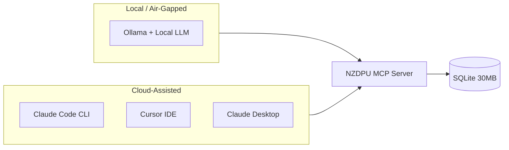

# NZDPU MCP Server

**Offline GHG emissions intelligence for 12,497 companies.**

A Model Context Protocol (MCP) server providing instant access to the [NZDPU (Net-Zero Data Public Utility)](https://nzdpu.com) emissions database. Run air-gapped with Ollama, or connect to Claude/Cursor for multi-agentic workflows.

```
┌─────────────────────────────────────────────────────────────────┐
│  12,497 Companies  •  33,630 Emissions Records  •  7 Tools      │
│  Scope 1, 2 (LB & MB), Scope 3 (15 categories)                  │
│  Data Quality Framework  •  Peer Benchmarking                   │
│  100% Offline After Install  •  No API Key Required             │
└─────────────────────────────────────────────────────────────────┘
```

---

## Why This Matters

| Feature | Benefit |
|---------|---------|
| **Air-Gapped** | No internet required after install. Works in secure environments. |
| **No API Key** | End users don't need NZDPU accounts. Database is pre-bundled. |
| **Privacy-First** | Combine with proprietary data — nothing leaves your machine. |
| **Instant Queries** | SQLite database returns results in <100ms, not API latency. |
| **Data Quality** | Built-in methodology, boundary, and verification scoring. |

---

## Use Cases

### Private Financial Analysis
Combine emissions data with proprietary financial datasets for ESG-integrated investment analysis. Your proprietary financial data never leaves your internal ecosystem.

```
Your Private Data          NZDPU MCP              Analysis
┌────────────┐         ┌────────────┐         ┌────────────┐
│ Portfolio  │         │ Emissions  │         │ ESG-Adj    │
│ Holdings   │───┬────▶│ by Company │────────▶│ Valuation  │
│ Financials │   │     │ Peer Bench │         │ Reports    │
└────────────┘   │     └────────────┘         └────────────┘
                 │
            100% Local (Ollama)
            or Cloud (Claude/Cursor)
```

### Multi-Agentic Workflows
Set up rules-based analysis in Cursor or Claude Code. 
Chain emissions queries with other data sources for automated research pipelines.

### Peer Benchmarking
Compare any company against:
- Same jurisdiction (e.g., all UK companies)
- Same sector (e.g., all Oil & Gas)
- Intersection (e.g., UK Oil & Gas peers)
- Same methodology for valid comparison

### ESG Research & Due Diligence
Understand disclosure quality before trusting reported numbers:
- Organizational boundary type
- Verification/assurance level
- Scope 3 methodology per category (PRIMARY vs MODELED)

---

## Example Outputs

Real examples from Claude Desktop and Claude Code CLI sessions:

### Peer Benchmarking: "Analyze [company A's] peer companies in Oil & Gas"

> **[company A's] Position Among Peers (2022)**
> 
> | Company | Scope 1 | Scope 3 | Quality |
> |---------|---------|---------|---------|
> | [company A] | 51.0M tCO₂e | 1,204M tCO₂e | HIGH |
> | [company B] | 39.4M tCO₂e | 179M tCO₂e | MEDIUM |
> | [company C] | 37.2M tCO₂e | 446M tCO₂e | HIGH |
> | [company D] | 30.4M tCO₂e | 307M tCO₂e | MEDIUM |
> | [company E] | 11.4M tCO₂e | 268M tCO₂e | HIGH |
> 
> **Key Insights:**
> - [company A] ranks at **75th percentile** for Scope 1 in Oil & Gas
> - Scope 3 is **20x larger** than Scope 1+2 combined (typical for O&G)
> - [company A] uses **operational control** boundary (highest quality)
> - Category 11 (Use of Sold Products) = 910M tCO₂e using **primary data**
> 
> **Comparability Warning:** [company D] and [company B] use "company-defined" boundaries (non-standard), limiting direct comparison.

### Educational Query: "Which sector is Scope 3 Category 7 important for?"

> **Scope 3 Category 7: Employee Commuting**
> 
> Most material for **labor-intensive services** companies:
> 
> | Company | Sector | Cat 7 | % of Total S3 |
> |---------|--------|-------|---------------|
> | [company F] | Staffing | 743K tCO₂e | **96%** |
> | [company G] | Consulting | 26K tCO₂e | 7% |
> | [company H] | Tech | 20K tCO₂e | 7% |
> | [company I] | Banking | 5K tCO₂e | 0.02% |
> 
> **Why?** Staffing companies have large office workforces with no manufacturing, products, or financed emissions to dwarf commuting impact.

### Simple Query (Claude Code CLI)

```
> How many companies are in the NZDPU database?

⏺ nzdpu_analyze (analysis: "overview")

The NZDPU database contains 12,497 unique companies 
with 33,630 emissions records.

Top jurisdictions:
- China: 2,457 companies
- United States: 1,898 companies  
- Japan: 1,357 companies
```

These examples show the depth of analysis possible — from simple counts to multi-dimensional peer comparisons with data quality context.

---

## Deployment Options

Choose your deployment based on privacy needs and reasoning capability:



| Deployment | Privacy | Reasoning Quality | Speed | Cost |
|------------|---------|-------------------|-------|------|
| **Ollama** (7-8B) | 100% local | Good for queries | 30s-2min | Free |
| **Ollama** (14B+) | 100% local | Good for analysis | 1-4min | Free |
| **Claude Code** | Cloud inference | Excellent | 2-10s | API cost |
| **Cursor** | Cloud inference | Excellent | 2-10s | Subscription |
| **Claude Desktop** | Cloud inference | Excellent | 2-10s | API cost |

---

## Quick Start

### Step 1: Install

```bash
git clone https://github.com/dp-veritas/nzdpu-mcp-server.git
cd nzdpu-mcp-server
npm install
npm run build
```

The database (30MB) is **pre-bundled** — no API key or build step required.

### Step 2: Choose Your Client

Jump to the setup guide for your preferred client:
- [Ollama (Air-Gapped)](#option-a-ollama-air-gapped)
- [Claude Code CLI](#option-b-claude-code-cli)
- [Cursor IDE](#option-c-cursor-ide)
- [Claude Desktop](#option-d-claude-desktop)

---

## Setup Guides

### Option A: Ollama (Air-Gapped)

Run 100% offline with local LLM inference. Perfect for secure environments or when you can't send data to the cloud.

#### Prerequisites

```bash
# Node.js 18+ required
node --version   # Should show v18.x.x or higher

# Ollama must be installed and running
ollama serve     # Start Ollama if not already running
```

#### Install a Model

Choose based on your hardware and analysis needs:

```bash
# For simple queries (list companies, get emissions)
ollama pull qwen3:8b        # 5GB, 8GB RAM

# For analysis tasks (benchmarking, comparisons)
ollama pull qwen2.5:14b-instruct   # 9GB, 16GB RAM

# For complex reasoning (multi-hop, synthesis)
ollama pull qwen3:30b       # 18GB, 32GB RAM
```

See [Model Recommendations](#model-recommendations-for-ollama) for detailed guidance.

#### Configure

You'll need an MCP client that works with Ollama. If you have one (like [ollama-mcp-agent](https://github.com/dp-veritas/ollama-obsidian-agent)), configure it:

```json
{
  "ollama": {
    "model": "qwen3:8b"
  },
  "mcpServers": {
    "nzdpu": {
      "command": "node",
      "args": ["/path/to/nzdpu-mcp-server/dist/index.js"]
    }
  }
}
```

#### Example Session

```
> How many companies are in the Oil & Gas sector?

Thinking...
  [Tool] nzdpu_list_companies({ sics_sub_sector: "Oil & Gas" })
  [Result] 67 companies found

There are 67 companies in the Oil & Gas sub-sector.

> Compare the top 5 by Scope 1 emissions

Thinking...
  [Tool] nzdpu_compare_companies({ company_ids: [12290, 8441, ...] })
  [Result] Comparison with data quality scores...

Here's the comparison:
| Company | Scope 1 (tCO2e) | Quality | Year |
|---------|-----------------|---------|------|
| ...     | ...             | ...     | ...  |
```

---

### Option B: Claude Code CLI

Use the `claude` command-line tool with cloud-powered reasoning.

#### Method 1: CLI Command

```bash
claude mcp add nzdpu --scope user -- node /path/to/nzdpu-mcp-server/dist/index.js
```

#### Method 2: Edit Config Directly

Edit `~/.claude.json`:

```json
{
  "mcpServers": {
    "nzdpu": {
      "type": "stdio",
      "command": "node",
      "args": ["/path/to/nzdpu-mcp-server/dist/index.js"]
    }
  }
}
```

#### Verify

Restart Claude Code, then check:

```bash
claude
# Once in session:
/mcp
# Should show "nzdpu" as connected
```

---

### Option C: Cursor IDE

Add to `~/.cursor/mcp.json`:

```json
{
  "mcpServers": {
    "nzdpu": {
      "command": "node",
      "args": ["/path/to/nzdpu-mcp-server/dist/index.js"]
    }
  }
}
```

Restart Cursor to load the MCP server.

---

### Option D: Claude Desktop

#### macOS

Edit `~/Library/Application Support/Claude/claude_desktop_config.json`:

```json
{
  "mcpServers": {
    "nzdpu": {
      "command": "node",
      "args": ["/path/to/nzdpu-mcp-server/dist/index.js"]
    }
  }
}
```

#### Windows

Edit `%APPDATA%\Claude\claude_desktop_config.json`:

```json
{
  "mcpServers": {
    "nzdpu": {
      "command": "node",
      "args": ["C:\\path\\to\\nzdpu-mcp-server\\dist\\index.js"]
    }
  }
}
```

Restart Claude Desktop to load the MCP server.

---

## Model Recommendations for Ollama

Different tasks require different model capabilities. Match your model to your use case:

| Task Type | Examples | Minimum | Recommended |
|-----------|----------|---------|-------------|
| **Simple queries** | List companies, count by sector, get emissions | 7B | `qwen3:8b` |
| **Basic analysis** | Compare peers, filter by jurisdiction | 7B-8B | `llama3.1:8b` |
| **Deep analysis** | Benchmark, assess quality, rank companies | 14B+ | `qwen2.5:14b-instruct` |
| **Complex reasoning** | Multi-hop queries, synthesis, cross-referencing | 30B+ | `qwen3:30b` |

### Recommended Models

| Model | Size | RAM | Best For |
|-------|------|-----|----------|
| `llama3.1:8b` | 4.5GB | 8GB | Simple queries, fast responses |
| `qwen3:8b` | 5GB | 8GB | Basic analysis with thinking |
| `mistral-nemo:12b` | 7GB | 12GB | Medium tasks, 128k context |
| `qwen2.5:14b-instruct` | 9GB | 16GB | Deep analysis, best mid-range |
| `qwen3:14b` | 9GB | 16GB | Cross-referencing, larger context |
| `qwen3:30b` | 18GB | 32GB | Complex reasoning, best local quality |

### Local vs Cloud Trade-offs

| Aspect | Local (Ollama 7-8B) | Local (Ollama 14B+) | Cloud (Claude/Cursor) |
|--------|---------------------|---------------------|----------------------|
| **Response time** | 30s - 2min | 1 - 4min | 2 - 10s |
| **Reasoning quality** | Good for simple | Good for analysis | Excellent |
| **Privacy** | 100% local | 100% local | Data to cloud |
| **Cost** | Free | Free | Free and subscription models depending on usage |
| **Offline** | Yes | Yes | No |

> **Key insight**: 7-8B models handle tool calling well but struggle with deep analysis. For benchmarking and quality assessment, use 14B+ models.

---

## Available Tools (7 Consolidated)

The MCP provides 7 intuitive, parameterized tools designed for easy LLM selection:

| Tool | When to Use | Key Parameters |
|------|-------------|----------------|
| `nzdpu_search` | Find companies by name, LEI, sector, or jurisdiction | `name`, `lei`, `jurisdiction`, `sector`, `sub_sector` |
| `nzdpu_emissions` | Get emissions data for a specific company | `company_id`, `year` |
| `nzdpu_list` | Explore available sectors, jurisdictions, or SICS hierarchy | `type`: sectors, jurisdictions, subsectors |
| `nzdpu_analyze` | Dataset-wide analytics (stats, top emitters, disclosure patterns) | `analysis`: overview, top_emitters, disclosure, data_issues |
| `nzdpu_benchmark` | Compare companies or benchmark against peers | `mode`: single, compare, peer_stats |
| `nzdpu_quality` | Detailed data quality assessment for a company | `company_id`, `year` |
| `nzdpu_learn` | Educational content about GHG accounting | `topic`: concepts, scope2, scope3, mistakes, comparability |

### Tool Details

#### `nzdpu_search`
Find companies by name, LEI, sector, or jurisdiction. Returns full profiles with nz_id for use with other tools.
```
Examples:
- Search by name: { name: "Microsoft" }
- Search by LEI: { lei: "549300..." }
- Filter by location: { jurisdiction: "France", sector: "Financials" }
```

#### `nzdpu_emissions`
Get Scope 1, 2 (LB & MB), and Scope 3 (all 15 categories) emissions with methodology info.
```
Examples:
- All years: { company_id: 12290 }
- Specific year: { company_id: 12290, year: 2022 }
```

#### `nzdpu_list`
Explore classification values in the database.
```
Examples:
- List sectors: { type: "sectors" }
- List countries: { type: "jurisdictions" }
- SICS hierarchy: { type: "subsectors" }
- Filtered: { type: "subsectors", sector: "Financials" }
```

#### `nzdpu_analyze`
Perform analytics across the full dataset.
```
Examples:
- Overview: { analysis: "overview" }
- Top emitters: { analysis: "top_emitters", scope: "scope1", limit: 10 }
- Disclosure history: { analysis: "disclosure", min_disclosures: 5 }
- Data issues: { analysis: "data_issues" }
```

#### `nzdpu_benchmark`
Compare and benchmark companies.
```
Examples:
- Single company: { mode: "single", company_id: 12290, scope: "scope1" }
- Compare multiple: { mode: "compare", company_ids: [12290, 8441, 7532] }
- Peer stats: { mode: "peer_stats", jurisdiction: "UK", sector: "Oil & Gas" }
```

#### `nzdpu_quality`
Detailed data quality assessment including Scope 3 methodology by category.
```
Example: { company_id: 12290, year: 2022 }
```

#### `nzdpu_learn`
Educational content about GHG emissions accounting.
```
Examples:
- List concepts: { topic: "concepts" }
- Specific concept: { topic: "concept:scope1" }
- Scope 2 guide: { topic: "scope2" }
- Scope 3 categories: { topic: "scope3" }
- Specific category: { topic: "scope3:11" }
- Common mistakes: { topic: "mistakes" }
- Comparability: { topic: "comparability:scope2_lb_vs_mb" }
```

---

## Rule File for Enhanced Interactions

A comprehensive rule file (`rule-nzdpu.md`) is included to help AI assistants understand GHG accounting nuances, data quality considerations, and tool selection guidance. This is optional but recommended for better results.

### What the Rule File Does

The rule file provides:

- **Tool selection guidance**: When to use each of the 7 tools
- **Data quality awareness**: How to interpret methodology, boundary, and verification
- **Comparability rules**: When data can/cannot be meaningfully compared
- **Sector materiality**: Which Scope 3 categories matter for each industry
- **Workflow patterns**: Standard query → quality → benchmark workflows
- **Educational triggers**: When to explain concepts vs. just return data

### When to Use It

Use the rule file when you want the AI assistant to:

- Automatically include data quality context with results
- Warn about comparability issues (e.g., Scope 2 LB vs MB)
- Focus on material Scope 3 categories for a given sector
- Provide educational explanations alongside data
- Follow GHG accounting best practices in analysis

### How to Apply the Rule File

#### For Cursor IDE

Copy to your Cursor rules folder:

```bash
cp rule-nzdpu.md ~/.cursor/rules/mcp\ rules/rule-nzdpu.md
```

The rule will automatically apply to Cursor chat sessions.

#### For Claude Desktop

Attach `rule-nzdpu.md` to your conversation, or copy its contents into a Claude Project's custom instructions.

#### For Claude Code CLI

Include in your system prompt or project instructions:

```bash
# Reference the rule file in your project
cat rule-nzdpu.md >> .claude/INSTRUCTIONS.md
```

#### For Ollama / Local LLMs

Include the rule content in your system prompt. For example, with `ollama-mcp-agent`:

```json
{
  "systemPrompt": "You are an NZDPU MCP-Aware GHG Emissions Analysis Partner...",
  "mcpServers": {
    "nzdpu": { ... }
  }
}
```

> **Tip**: For Ollama, use a condensed version of the rules focused on tool selection and comparability warnings, as smaller models may not retain extensive context.

### Rule File Contents

| Section | Description |
|---------|-------------|
| **Context & Role** | Defines the assistant as a "GHG Emissions Analysis Partner" |
| **7 Tools Reference** | Complete parameter documentation |
| **Data Quality Rules** | Scope 2 LB/MB, boundary types, verification levels |
| **Sector Materiality** | Which Scope 3 categories matter by sector |
| **Example Interactions** | 6 detailed scenarios with response patterns |

---

## Data Quality Framework

The server provides comprehensive quality assessment based on three pillars:

### 1. Organizational Boundary

| Boundary Type | Score | Notes |
|---------------|-------|-------|
| Operational control | HIGH | GHG Protocol standard |
| Financial control | HIGH | GHG Protocol standard |
| Equity share | MEDIUM | GHG Protocol standard |
| Company-defined | LOW | Non-standard, limits comparability |

### 2. Verification Status

| Level | Score |
|-------|-------|
| Reasonable assurance | HIGH |
| Limited assurance | MEDIUM |
| No verification | LOW |

### 3. Scope 3 Methodology Quality

| Tier | Methods | Description |
|------|---------|-------------|
| PRIMARY | Supplier-specific, Hybrid, Asset-specific | Uses primary data |
| MODELED | Spend-based, Average-data, Distance-based | Uses estimates |
| UNKNOWN | Not disclosed | Cannot assess quality |

---

## Important Data Limitations

### Restatements

The NZDPU API **only provides the latest revision** for each reporting year. If a company restated their 2021 emissions in 2023:
- You see the **restated value** (current)
- You do **NOT** see the original value
- A revision number indicates how many times data was revised

### Scope 2 Comparability

**Location-based and market-based Scope 2 cannot be compared.** They measure different things:
- **Location-based**: Grid-average emissions factor
- **Market-based**: Contractual instruments (RECs, PPAs)

The server warns when attempting invalid comparisons.

### Potential Data Quality Issues

Some values may have:
- **Unit errors**: kg reported as tonnes (values > 1 billion tCO₂e)
- **Placeholder values**: Round numbers like exactly 1,000,000
- **Methodology changes**: Year-over-year comparisons affected

Use `nzdpu_validate_data` to identify potential issues.

---

## Data Refresh (Maintainers Only)

The database is pre-bundled. **End users do not need an API key.**

For maintainers refreshing data:

### Get an API Key (Free)

1. Go to [https://nzdpu.com/sign-up](https://nzdpu.com/sign-up)
2. Create a free account
3. Get your API key from the dashboard

### Rebuild the Database

```bash
export NZDPU_API_KEY=your_api_key_here
rm data/nzdpu.db
npm run build-db
```

Takes ~15-30 minutes. Commit the updated `data/nzdpu.db` to distribute fresh data.

---

## Troubleshooting

### "Database not found" error

The database is in path `data/nzdpu.db`. If missing:
1. Re-clone the repository (database is tracked in git)
2. Or rebuild it yourself (see [Data Refresh](#data-refresh-maintainers-only))

### MCP server not showing in Claude Code

1. Check config file location (`~/.claude.json` for Claude Code CLI)
2. Verify path to `dist/index.js` is correct and absolute
3. Restart Claude Code after config changes
4. Run `/mcp` to check server status

### Ollama: "Model not available"

```bash
ollama pull qwen3:8b  # or your chosen model
ollama serve          # ensure Ollama is running
```

### Ollama: Poor tool selection

Use a larger model. 7B models may choose wrong tools for complex queries. Try 14B+ for analysis tasks.

### Slow responses with Ollama

This is expected — local LLM inference is slower than cloud APIs. For faster responses:
- Use smaller models for simple queries, and manually specify the tools the LLM should leverage.
- Use cloud clients (Claude/Cursor) for complex, multi-step, and time-sensitive tasks

---

## Development

### Build from Source

```bash
npm install
npm run build
```

### Project Structure

```
nzdpu-mcp-server/
├── src/
│   ├── index.ts           # MCP server & tool handlers
│   ├── db/
│   │   ├── schema.ts      # SQLite schema
│   │   └── queries.ts     # Database query functions
│   ├── knowledge/
│   │   ├── concepts.ts    # GHG accounting concepts
│   │   ├── comparability.ts
│   │   └── materiality.ts # Sector-specific S3 materiality
│   └── types/
│       └── index.ts       # TypeScript interfaces
├── data/
│   └── nzdpu.db           # SQLite database (PRE-BUNDLED)
└── scripts/
    └── build-database.ts  # Database build (maintainers only)
```

---

## License

MIT

---

## Acknowledgments

Data provided by [NZDPU (Net-Zero Data Public Utility)](https://nzdpu.com), a free public resource for climate transition data.
